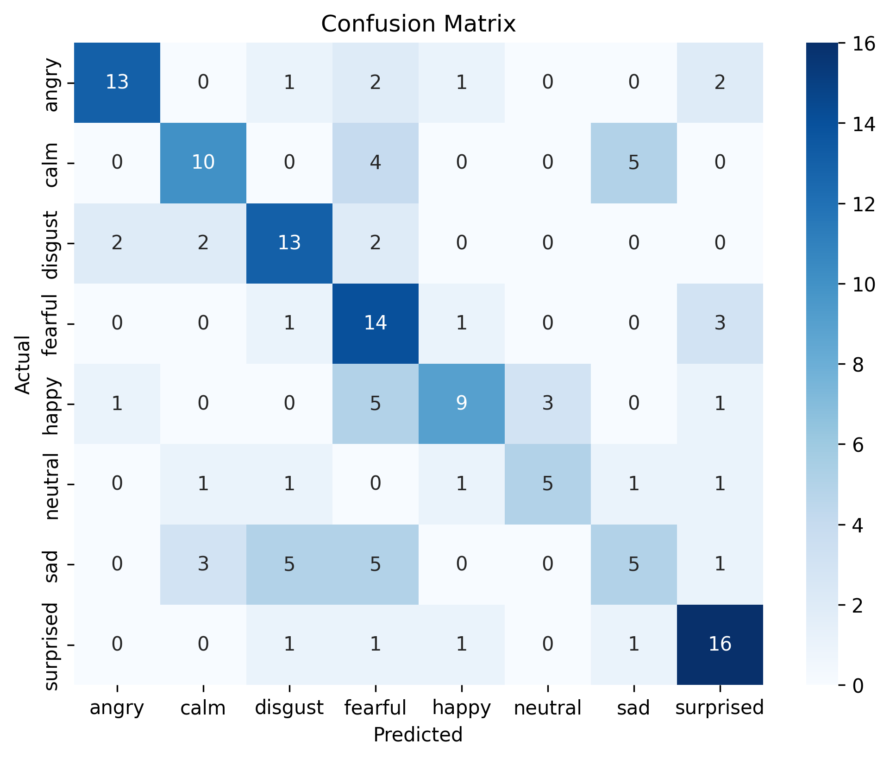

# Speech Emotion Recognition 

## Results
- Test Accuracy: **59.0%**
- Macro F1: **58.2%** 
- Male F1: **59.7%** | Female F1: **53.3%**

## Pipeline
- Log-Mel spectrograms + silence trim
- 2D CNN (3 Conv blocks + GlobalAvgPool)
- 80/10/10 stratified split
- Full eval + predict.py ready

